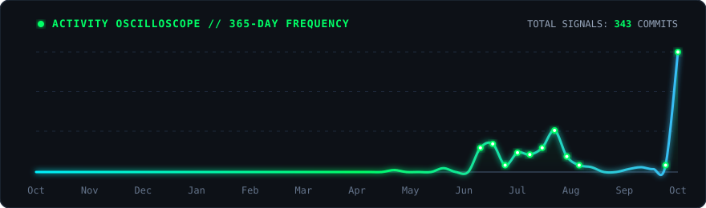

  <!-- 3D COSMIC DEPTH FLUID WAVE BANNER -->
  

  <!-- 2D ROTATING TEXT ANIMATION -->
  

  <!-- 3D CYBER LASER BEAM SCROLLING DIVIDER -->
  

  <!-- MINIMALIST GLOW PILL BUTTONS -->
  

    
    
    
  

 

<!-- MINIMALIST BENTO MATRIX -->
<table width="100%">
  <tr>
    <td width="50%" valign="top">
      <h3>⚡ OPERATOR SPECS</h3>
      <ul>
        <li>📍 <b>Base:</b> Gopalapatnam, India</li>
        <li>🏢 <b>Studio:</b> Vajra Hub</li>
        <li>🌐 <b>Digital HQ:</b> <a href="https://nithin.akao.in/"><b>nithin.akao.in</b></a></li>
        <li>📫 <b>Direct:</b> <code>white018899@gmail.com</code></li>
      </ul>
    </td>
    <td width="50%" valign="top">
      <h3>🎯 FOCUS & ARCHITECTURE</h3>
      
Obsessed with clean code architecture, smooth 60fps micro-interactions, responsive frontends, and robust full-stack engineering.

       
      
    </td>
  </tr>
</table>

---

### 🛠️ // WEAPONS & TECH STACK

   
  <!-- UNIFIED GLOWING MATRIX -->
  
    

---

### 📊 // TELEMETRY & LIVE STATS

  <!-- UNIFIED STATS CARDS (GRADE CIRCLE REMOVED) -->
  
  

    

  <!-- ANIMATED STREAK RADAR -->
  

---

### 📈 // ACTIVITY OSCILLOSCOPE & RADAR

  

### 🚀 // FEATURED BUILDS

  
  

 

---

### ✍️ // VISITOR GUESTBOOK

  
Leave a message, feedback, or say hi! Your note will appear here automatically.

  

 

<!-- START_SECTION:guestbook -->

<i>Be the first to sign! Click the button above to leave your signature.</i>

<!-- END_SECTION:guestbook -->

  <!-- MATCHING COSMIC WAVE FOOTER -->
  

